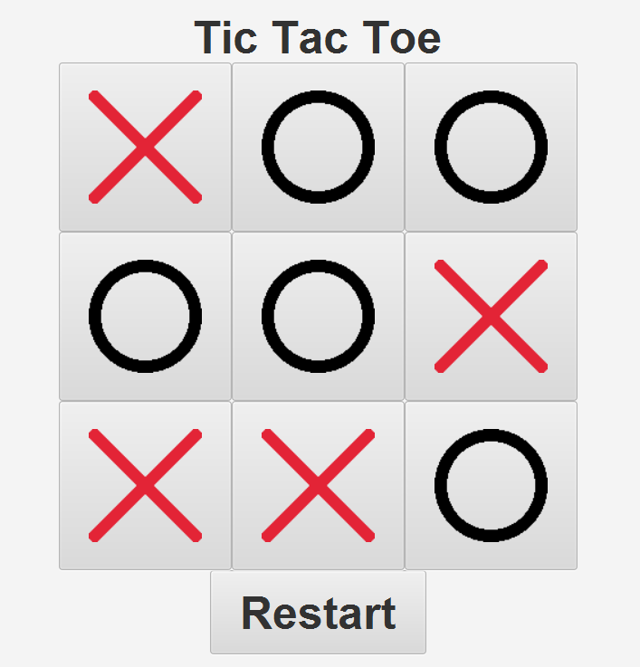

# Tic Tac Toe JavaFX

Tic Tac Toe JavaFX is a simple implementation of the classic Tic Tac Toe game using JavaFX for the graphical user interface. It allows users to play against an AI opponent.



## Features

- Play against an AI opponent.
- Simple and intuitive graphical user interface.
- Alerts for game over, winner announcement, and draw.
- Restart functionality to start a new game.

## Setup

To run the Tic Tac Toe JavaFX project locally, follow these steps:

1. Clone the repository:
   ```bash
   git clone https://github.com/invictus-21/TicTacToe.git
   ```
2. Navigate to the project directory:
   ```bash
   cd tictactoe
   ```
3. Run the script:
   ```bash
   script.sh
   ```

## Usage

- Upon running the application, the Tic Tac Toe game board will be displayed.
- Click on a cell to make a move. Wait for the AI to make its move.
- The game will continue until a player wins, the game ends in a draw, or the player decides to restart the game.
- Use the "Restart" button to start a new game after the current game is over.